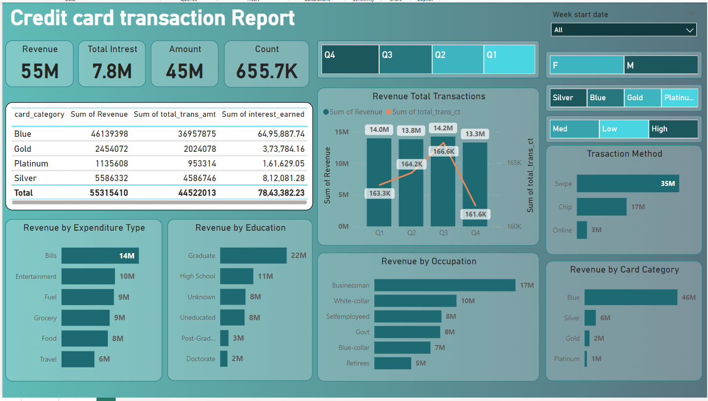

# Credit card financial dashboard using Power BI:
All the resources (Csv(s)) files are included
## Project Leanings

- Developed an interactive dashboard using transaction and customer data from a SQL database, to provide real-time insights.
- Streamlined data processing & analysis to monitor key performance metrics and trends.
- Shared actionable insights with stakeholders based on dashboard findings to support decision-making processes.
- Used different types of customized visualization (bar chart, pie chart, donut chart, clustered bar chart, slicers, etc)

## Screenshots.
### Home Page.
