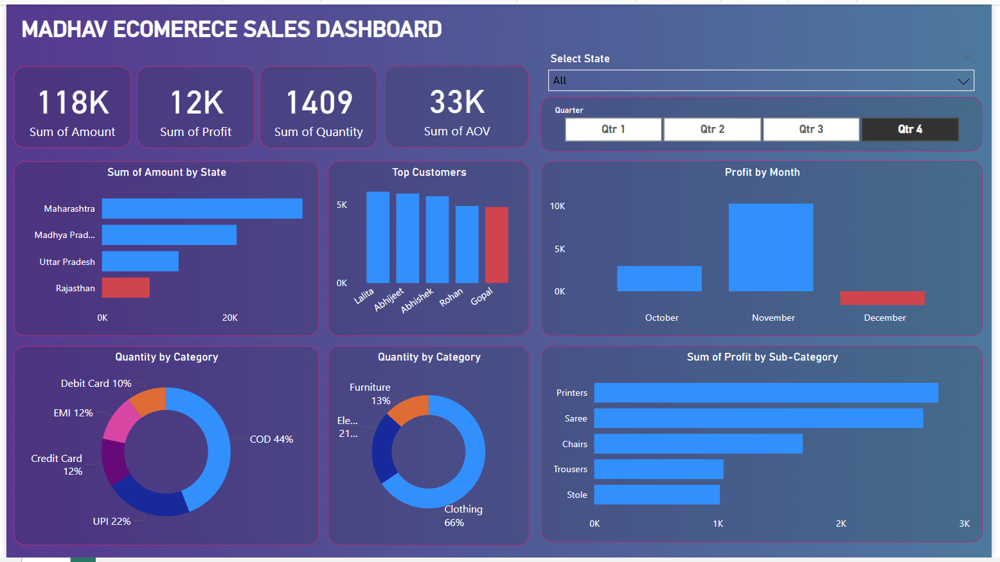
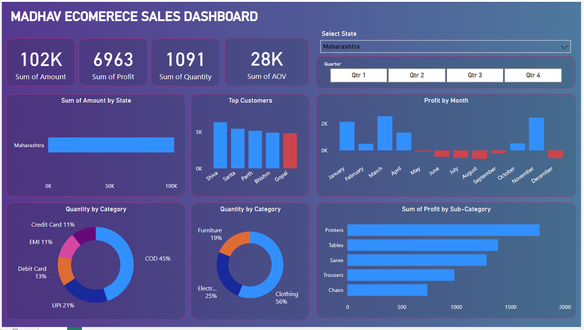

# Madhav Sales Ecommerce Dashboard Project Using Power BI.
All the resources (Csv(s)) files are included
## Project Leanings

- Created interactive dashboard to track and analyze online sales data
- Used complex parameters to drill down in worksheet and customization using filters and slicers
- Created connections, join new tables, calculations to manipulate data and enable user driven arameters for visualizations
- Used different types of customized visualization (bar chart, pie chart, donut chart, clustered bar chart, slicers, etc)

## Screenshots.
### Home Page.

### Quarterly results

### By State

